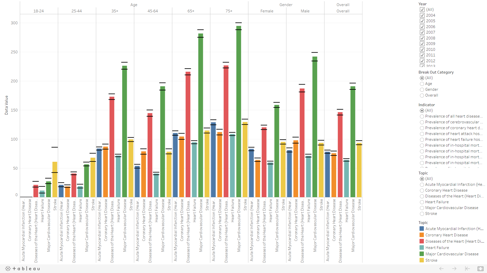

# Healthcare Cost And Utilization Project Tableau Visualization

Create Healthcare Cost and Utilization Project (HCUP) - National Inpatient Sample Visualization using Tableau.



Link to Tableau Visualization: https://public.tableau.com/profile/emily6902#!/vizhome/HealthcareCostandUtilizationProject/HealthcareCostUtilizationProject

## Description
First, I look through the dataset to find the relevant variables that will be useful for healthcare planners to identify key risk health factors that result in hospital stays. Notice that the relevant fields are Topic, Indicator, Data Value, Confidence Limit Low/High and Break Out.

- Bar Chart: We have lots of information to display for different analytical needs. Bar chart is chosen to reduce the complexity and make it simple to read.
- Color indication for Topic: These are the key reason that result in hospital stay. By color coding them will helps user to read them easily.
- Radio Button Filter Options: To allow user to filter (e.g. Gender, Age Group, etc) data or reveal details as needed.
- Checkbox Filter Option for Year: To allow user to filter by year or multiple years to reveal details as needed.
- Confidence Limits included as black line for each bar: To show either of the extreme values of a confidence interval.

### Observation
- People with age of 65 and above have a higher percentage of hospitalisation.
- The top 2 topic for hospitalisation are Major Cardiovascular Disease and Diseases of the Heart (Heart Disease).
- Most patients are male and are hospitalised due to Major Cardiovascular Disease.
- The age group of 18-24 years old are not affected by Acute Myocardial Infarction (Heart Attack) and Coronary Heart Disease.

### Files
1. ```Screenshots/HCUP_Visualization.png``` visualization image of Passenger survival by Age, Sex and Ticket class
2. ```Healthcare_Cost_and_Utilization_ Project.twbx``` Tableau Packaged Workbook file.
3.  ```Healthcare_Cost_and_Utilization_Project__HCUP__-_National_Inpatient_Sample.csv``` contains the raw dataset.

### References
[Healthcare Cost and Utilization Project (HCUP) - National Inpatient Sample](https://catalog.data.gov/dataset/healthcare-cost-and-utilization-project-hcup-national-inpatient-sample-4a7c2)
